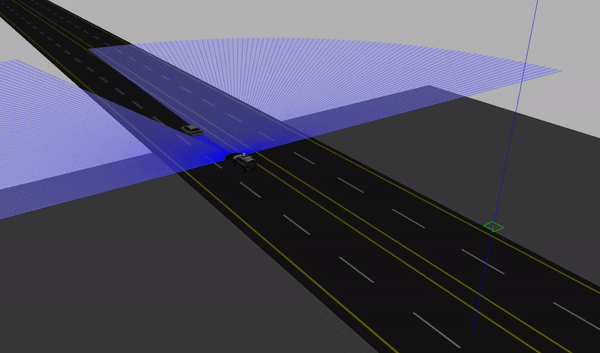

# Autonomous Vehicle Hybrid-Controller

Packages for running a hybrid controller for autonomous vehicles in highway driving scenarios. The idea is to keep a safe distance when the obstacle vehicle is at the posted speed and overtake when the obstacle speed goes below the posted speed. ( posted speed is the speed limit of the highway)
 

git clone https://github.com/Singh-sid930/Autonomous_Vehicles_Hybrid_Controller.git

This repository can work as a stand alone workspace. Feel free to extract any of the packages from the src/.
I only claim ownership of the following packages: 
1. center_line 
2. mpc_tracker
3. rrt_star

Regards to people from ASU to build the catvehicle package.  

Please dont beat me up over the code quality. This was built in two days. 

For any issues mail on sidsingh@seas.upenn.edu or Singh.sid930@gmail.com

